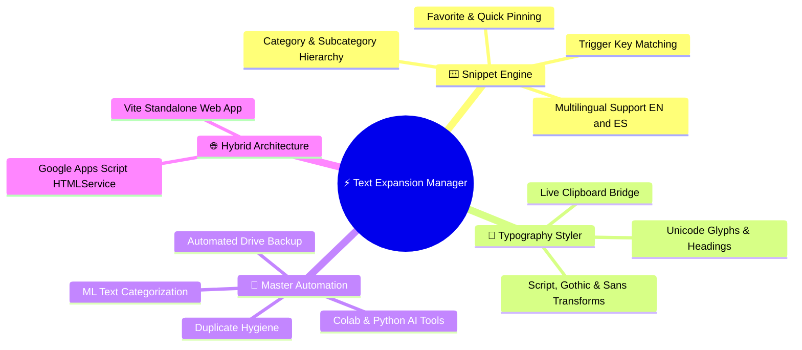
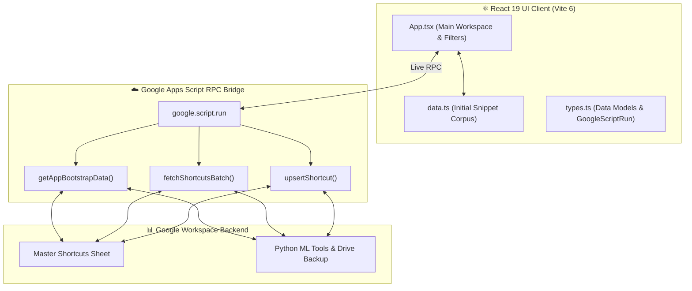

<!-- ⚡ TEXT EXPANSION MANAGER 06 — REPOSITORY PRESENTATION (L3 SHOWCASE) -->

<div align="center">


# **⚡ Text Expansion Manager (v06)**

**A modern multilingual snippet studio, typography transformer, and Master Automation Framework console built with React 19, TypeScript, and Vite.**

[](#-core-features)
[](package.json)
[](tsconfig.json)
[](vite.config.ts)
[](types.ts)
[](LICENSE)
[](https://github.com/traikdude/Text-Expansion-Manager-06)

<p align="center">
  <a href="#-overview"><b>Overview</b></a> •
  <a href="#-core-features"><b>Features</b></a> •
  <a href="#-multilingual--typography"><b>Multilingual & Fonts</b></a> •
  <a href="#-master-automation-framework"><b>Automation Framework</b></a> •
  <a href="#-architecture"><b>Architecture</b></a> •
  <a href="#-quick-start--local-development"><b>Quick Start</b></a> •
  <a href="#-contributing"><b>Contributing</b></a> •
  <a href="#-license"><b>License</b></a>
</p>

</div>

---

## 📑 Table of Contents

- [✨ Overview](#-overview)
- [🚀 Core Features](#-core-features)
  - [1. Multilingual Snippet & Macro Management](#1-multilingual-snippet--macro-management)
  - [2. Interactive Typography & Font Stylizers](#2-interactive-typography--font-stylizers)
  - [3. Master Automation Framework Bridge](#3-master-automation-framework-bridge)
  - [4. Batch Import, De-duplication & Hygiene](#4-batch-import-de-duplication--hygiene)
  - [5. Dual Deployment Target (Vite + Apps Script)](#5-dual-deployment-target-vite--apps-script)
- [🌐 Multilingual & Typography Features](#-multilingual--typography-features)
- [🤖 Master Automation Framework Integration](#-master-automation-framework-integration)
- [🏗️ Architecture & Data Flow](#-architecture--data-flow)
- [🛠️ Tech Stack](#-tech-stack)
- [⚡ Quick Start & Local Development](#-quick-start--local-development)
- [🗂️ Repository Structure](#-repository-structure)
- [🤝 Contributing](#-contributing)
- [📄 License](#-license)

---

## ✨ Overview

**Text Expansion Manager (v06)** is a next-generation visual snippet studio and typography engine designed for heavy keyboard users, translators, automation engineers, and content creators.

Built on **React 19** and **TypeScript**, the platform manages thousands of text expansion macros across English, Spanish, and multi-lingual domains. It features real-time search, instant typography transformations, batch import/export pipelines, duplicate hygiene tools, and direct RPC bindings to Google Apps Script's Master Automation Framework.

---

## 🚀 Core Features



### 1. Multilingual Snippet & Macro Management
Full CRUD for shortcut keys (`k`), expansions (`e`), categories (`s`), and descriptive metadata (`d`) with dedicated English and Spanish segmentation.

### 2. Interactive Typography & Font Stylizers
Transforms standard text into stylized unicode headers, cursive scripts, gothic runes, and mathematical alphanumerics for striking social and documentation formatting.

### 3. Master Automation Framework Bridge
Direct RPC handlers (`google.script.run`) connecting the frontend to cloud utilities including Colab ML categorizers, data quality auditors, and automated Drive backups.

### 4. Batch Import, De-duplication & Hygiene
Bulk import text expansion bundles with automatic duplicate detection, tag normalization, and one-click database cleanup.

### 5. Dual Deployment Target (Vite + Apps Script)
Runs as an ultra-fast local Vite web app or seamlessly embeds into Google Apps Script webapps with automatic bootstrap fallback.

---

## 🌐 Multilingual & Typography Features

| Feature | Description | Supported Modes |
|---|---|---|
| 🇬🇧 **English Snippets** | Standard English macros, email templates, code idioms | Single-line, multi-paragraph, placeholders |
| 🇪🇸 **Spanish Snippets** | Accented characters, localized formal/informal business templates | `¡`, `¿`, `ñ`, `á`, `é`, `í`, `ó`, `ú` safe |
| 🎨 **Typography Transforms** | Real-time unicode font rendering | Bold, Italic, Monospace, Gothic, Mathematical |
| ⭐ **Pin & Favorites** | Quick-access bookmarking for high-frequency triggers | LocalStorage & Google Drive persistence |

---

## 🤖 Master Automation Framework Integration

The client natively interfaces with enterprise automation tools:

```text
┌────────────────────────────────────────────────────────────────────────┐
│                   MASTER AUTOMATION FRAMEWORK RPC                      │
├───────────────────────┬────────────────────────┬───────────────────────┤
│ 🐍 Python AI Tools    │ ☁️ Cloud Utilities     │ 🧹 Hygiene & Cleanup  │
│ • ML Categorizer      │ • Drive Backup System  │ • Duplicate Shortcuts │
│ • Duplicate Finder    │ • Link Manager Dialog  │ • Favorite Purge      │
│ • Analytics Dashboard │ • Project Folder Maker │ • All Duplicates Purge│
└───────────────────────┴────────────────────────┴───────────────────────┘
```

---

## 🏗️ Architecture & Data Flow



---

## 🛠️ Tech Stack

* **Frontend Framework**: React 19 (`react` 19.2.3, `react-dom` 19.2.3)
* **Language & Typing**: TypeScript 5.8.2 (`tsconfig.json`)
* **Build System**: Vite 6.2.0 (`vite.config.ts`)
* **Platform Target**: Local Web Application & Google Apps Script HTMLService
* **Styling**: Tailwind CSS utility classes with dark obsidian & cyber-blue themes

---

## ⚡ Quick Start & Local Development

### Prerequisites
* [Node.js](https://nodejs.org/) (v18+ or v20+)
* `npm` or `pnpm`

### Setup Instructions
1. Clone the repository:
   ```bash
   git clone https://github.com/traikdude/Text-Expansion-Manager-06.git
   cd Text-Expansion-Manager-06
   ```
2. Install dependencies:
   ```bash
   npm install
   ```
3. Start the local Vite development server:
   ```bash
   npm run dev
   ```
4. Open `http://localhost:5173` in your browser.

---

## 🗂️ Repository Structure

```text
Text-Expansion-Manager-06/
├── docs/                        # Presentation & visual assets
│   └── assets/
│       └── banner.png           # L3 Showcase high-resolution hero banner
├── App.tsx                      # 70KB+ Main studio controller & search engine
├── data.ts                      # 115KB+ Default snippet database & macros
├── types.ts                     # TypeScript interfaces & GoogleScriptRun RPC
├── index.html                   # HTML entry shell
├── index.tsx                    # React 19 DOM entrypoint
├── package.json                 # Project dependencies & scripts
├── tsconfig.json                # TypeScript compiler configuration
├── vite.config.ts               # Vite bundler configuration
├── README.md                    # L3 Showcase presentation documentation
└── LICENSE                      # MIT Open Source License
```

---

## 🤝 Contributing

1. Fork the repository and create your branch (`git checkout -b feature/new-macro-pack`).
2. Add new snippet definitions or font transforms in `data.ts` and `App.tsx`.
3. Verify that the build succeeds without errors: `npm run build`.
4. Submit a Pull Request.

---

## 📄 License

Distributed under the **MIT License**. See [LICENSE](LICENSE) for details.

---

<div align="center">

*Engineered for Keyboard Virtuosos, Translators & Master Automators.*  
**Text Expansion Manager · React 19 · TypeScript · Vite · Google Apps Script**

</div>
